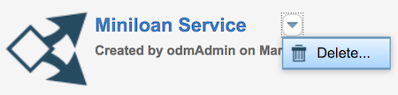

# Task 5: Cleaning the databases

In this task, you learn how to delete projects from Decision Center and the Decision Server console.

**About this task**

It is good practice to remove projects from the database when you no longer need them. This task can be delegated to your administrator, but if it is your own instance and you want to start the tutorial again you can do this too.

Note that you can export a project from Decision Center to a .zip before deleting it if you want to keep your changes.

## Step 1: Deleting the decision service from Decision Center 

You remove the Miniloan Service decision service from the Decision Center database.

1.   Open the Decision Center Business console.
2.  Log in by entering `odmAdmin` as the user name and password. Note that you must have the ODM role of administrator to remove the decision service. As a result, rtsUser1 cannot remove the decision service.
3.  Open the **Library** tab.
4.  Hover over the Miniloan Service box, open the drop-down menu and click **Delete**:

A warning message opens. It shows the decision service that you selected.
5.  Click **Delete**.

## Step 2: Removing the decision service from the Decision Server console

You remove the decision artifacts from the Decision Server console.

1.   Open the Decision Server console. 
2.  Log in by entering `odmAdmin` as the user name and password.
3.   Open the **Explorer** tab, and click **RuleApps** under **Navigator**. 
4.   Select the mydeployment, and click **Remove** to delete the RuleApp. A warning message opens. It shows the RuleApp that you selected.
5.   Click **Confirm** in the warning message. The console deletes your RuleApp. The RuleApp view opens, and it no longer shows your RuleApp.
6.  In the **Explorer** tab, click **Resources** under **Navigator**.
7.  Select miniloan-xom.zip, and click **Remove all references**. A warning message opens. It shows the execution object model that you selected.
8.  Click **Confirm** in the warning message.Now the execution object model is not referenced from any ruleset or library.
9.  Select miniloan-xom.zip, and click **Remove** to remove the execution object model cleanly.
10. In the **Explorer** tab, click **Libraries** under **Navigator**.
11. Select mydeployment\_1.0, and click **Remove** to remove the library. 

    **Note:** You can also remove the Miniloan\_Service\_brm.Branch\_xx\_xx library. This library was created when you ran the test suite.

You have completed the tutorial and removed the decision service from Decision Center and the Decision Server console. By completing this tutorial, you learned some of the key features of Operational Decision Manager on IBM Cloud Private.

[ **Back to table of contents**](../README.md)

