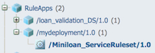
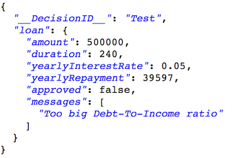

# Task 4: Exploring and testing the ruleset

In this task, you learn how to open and explore a RuleApp in the Decision Server console, and test a ruleset for REST execution.

The Decision Server console is used to manage and execute rulesets, trace executions, and see all the rules that are associated with a decision.

In this task, you will explore the artifacts in the Decision Server console that you deployed from Decision Center in task 3, make sure the status of the ruleset is enabled for execution, and then send a JSON formatted REST request to the ruleset.

## Step 1: Viewing the deployed RuleApp

You view the RuleApp in the Decision Server console and check the status of the ruleset.

1.   Sign in to your instance of the Decision Server console by using odmAdmin as the user name and password. 
2.  Click the **Explorer** tab.
3.   In the Navigator, expand **RuleApps**, and then /mydeployment/1.0. You see that the Decision Server console contains version 1.0 of mydeployment, which contains version 1.0 of Miniloan\_ServiceRuleset:

 

4.   Click /Miniloan\_ServiceRuleset/1.0 to view the details of the ruleset in the Ruleset View. The status of the ruleset is enabled, indicating that it can be run:

 

## Step 2: Testing the ruleset for REST execution

You test the REST execution of the Miniloan\_ServiceRuleset ruleset from the Decision Server console.

1.   In the Decision Server console, on the Miniloan\_ServiceRuleset page, click **Retrieve HTDS Description File**. 
2.   Select the **REST** option, and then choose **OpenAPI-JSON** for the format. 
3.  Click **View** and copy the URL.The decision service URL uses the following format:

 -   If you are using ODM for developers:
        
    http://<host>:<port>/DecisionService/rest/v1/mydeployment/1.0/Miniloan_ServiceRuleset/1.0/
        

 -   If you are using ODM for production:

        
    https://<host>:<port>/DecisionService/rest/v1/mydeployment/1.0/Miniloan_ServiceRuleset/1.0/
        

 You will need the URL to execute the request in [Step 3 \(optional\): Testing the execution of the ruleset using curl](../gs_topics/tut_icp_gs_test_ruleset_lsn.md#step-3-optional-testing-the-execution-of-the-ruleset-using-curl).

4.  Close the web page.
5.  Back on the Miniloan\_ServiceRuleset page, click **Retrieve HTDS Description File**.
6.   Make sure **REST** and **OpenAPI-JSON** are still selected, and click **Test**. 
7.   On the REST Service page, replace the entire request description with the following text: 

    {
       "loan": {
           "amount":500000,
           "duration":240,
           "yearlyInterestRate": 0.05
       },
       "__DecisionID__": "Test",
       "borrower": {
          "name":"Joe",
          "creditScore":600,
          "yearlyIncome":80000
       }
    }

8.  Click **Execute request**.The Server Response returns the following data:

 

 It shows that the loan is rejected because the debt-to-income ratio is too high.

9.  Log out from the Decision Server console.

## Step 3 \(optional\): Testing the execution of the ruleset using cURL

You test the execution of the Miniloan\_ServiceRuleset ruleset in a command terminal using cURL, a command-line tool for getting or sending files using URL syntax. This step is optional. If you do not wish to install cURL, you will not be able to perform this step. It is recommended to go through this step even if you choose not to perform it, as it shows an example of how to execute a ruleset using an external client.

1.  Open a command terminal.
2.  Go to the location where you extracted the Miniloan Service on your computer \(GettingStartedDirectory/odm-icp-gettingstarted-master/Miniloan Service\).
3.  Type the following command: 

    
    curl -X POST -H "Content-Type: application/json" decisionserviceURL -u resExecutor:resExecutor -d "@test.json"
    

 Where decisionserviceURL is the URL you copied in [Step 2: Testing the ruleset for REST execution](../gs_topics/tut_icp_gs_test_ruleset_lsn.md#step-2-testing-the-ruleset-for-rest-execution).

 The command issues a POST request for the URL of your decision service. The execution parameters are stored in the test JSON file that is delivered with the Miniloan Service sample project.

4.  Press Enter.The command returns the following output:

 

 It shows that the loan is rejected because the debt-to-income ratio is too high.

   **Note:** ODM for production users might receive the following error when running the cURL command:

    
    curl: (60) SSL certificate problem: self signed certificate in certificate chain
    

 To fix this issue, you must add a -k option to the command, as shown in the following example:

    
    curl -X POST -H "Content-Type: application/json" -k https://<host>:<port>/DecisionService/rest/v1/mydeployment/1.0/Miniloan_ServiceRuleset/1.0/ -u resExecutor:resExecutor -d "@test.json"
    

 This option allows cURL to ignore self-signed certificate errors, and proceed even for server connections otherwise considered insecure. If you run into this issue, contact your administrator to check your certificate installation.

You have finished the tutorial, and no longer need the decision service in Decision Center and the Decision Server console. In the next task, you remove the Miniloan decision service from Decision Center and the Decision Server console. [**Next** ](../gs_topics/tut_icp_gs_clean_db_lsn.md)

[ **Back to table of contents**](../README.md)

